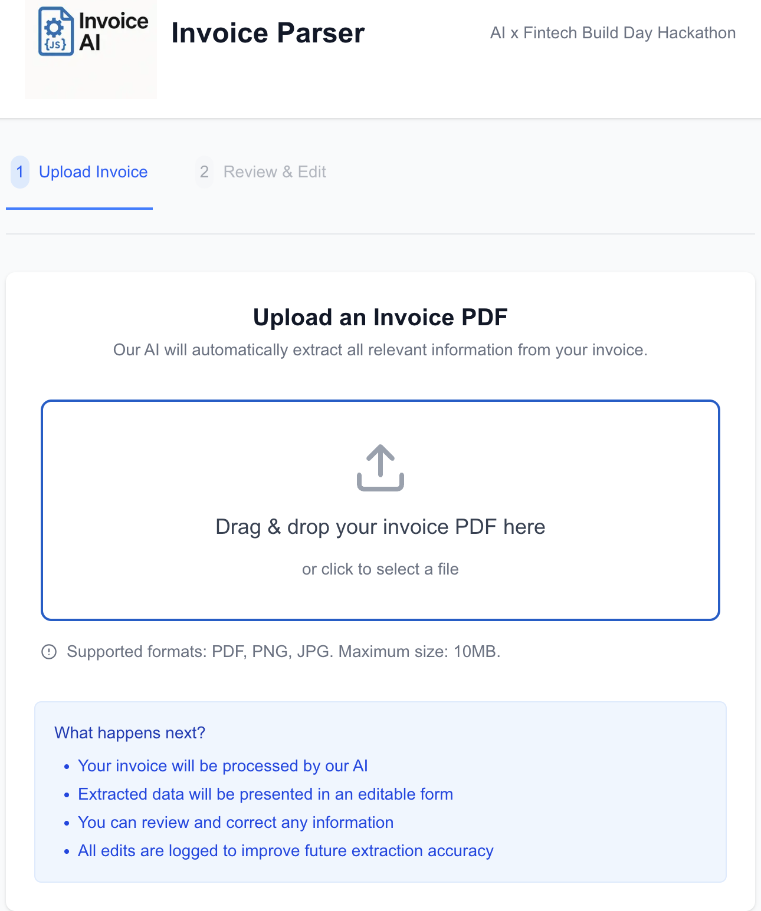
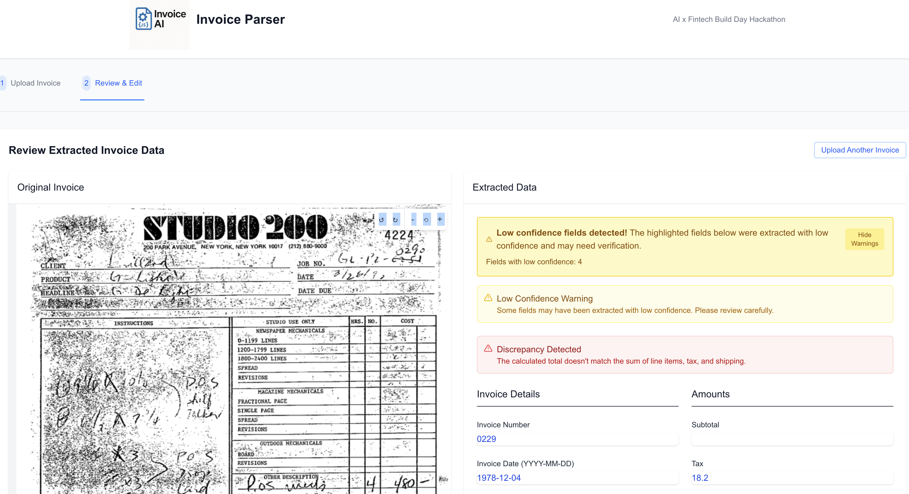

# AI Invoice Parser - Hackathon Prototype

## Overview
A lightweight AI-powered web app that automates the extraction of structured, machine-readable data from PDF/PNG/JPG invoices. Built as a [Ramp](https://ramp.com/)-style prototype for the AI x Fintech Build Day hackathon. Features intelligent confidence scoring and visual highlighting of potentially incorrect data.

Let the AI do the paperwork. You focus on the real work!

## Problem Statement

**The Challenge of Financial Document Processing**

Organizations face significant challenges managing the diverse array of financial documents that drive their operations. From invoices and receipts to contracts and statements, these documents contain critical data that must be accurately extracted, categorized, and integrated into financial systems. The current landscape presents several key challenges:

1. **Manual Processing Bottlenecks**: Finance teams spend excessive time manually processing documents, creating operational inefficiencies and delaying financial insights
   
2. **Format Diversity**: Financial documents come in countless formats, layouts, and languages, making standardized extraction difficult

3. **Data Accuracy Concerns**: Manual extraction and entry introduce errors that can cascade through financial systems, affecting reporting and decision-making

4. **Verification Overhead**: Ensuring data accuracy requires careful human review, creating a trade-off between speed and reliability

5. **Integration Complexity**: Extracted data must seamlessly flow into various financial systems, requiring careful mapping and transformation

**Our Solution: AI Invoice Parser**

This prototype demonstrates our approach through an invoice processing application that:

- Automates extraction of structured, machine-readable data from PDF and image-based invoices
- Employs confidence scoring (0.0-1.0) for each extracted field to identify potentially problematic data
- Visually highlights fields with low confidence for efficient human verification
- Validates numerical consistency by checking if invoice totals match the sum of line items
- Provides a human-in-the-loop workflow for reviewing and correcting extracted data
- Enables image rotation and zoom controls for better document viewing
- Delivers a clean, structured JSON output ready for integration with financial systems

This implementation showcases how AI can transform financial document processing while maintaining the critical human oversight needed for accuracy and compliance.

## Getting Started

### Prerequisites
- Python 3.8+ for the backend
- Node.js and npm for the frontend
- OpenAI API key (optional - mock data will be used if not provided)

### Backend Setup
1. Navigate to the project directory
2. Install dependencies using uv (recommended) or pip:
   ```bash
   # Using uv (recommended)
   uv sync
   
   # Or using pip
   pip install -e .
   ```
3. Set your OpenAI API key in `backend/.env` (optional)
4. Start the backend server:
   ```bash
   cd backend
   python run.py
   ```
   The server will be available at http://localhost:8080

### Frontend Setup
1. Navigate to the frontend directory
   ```bash
   cd frontend
   ```
2. Install dependencies:
   ```bash
   npm install
   ```
3. Start the development server:
   ```bash
   npm run dev
   ```
   The application will be available at http://localhost:3000

## Features
- Upload PDF invoices via a simple front-end interface
- AI-powered extraction of structured data using OpenAI's API
- Confidence scoring for all extracted fields (0.0-1.0 scale)
- Visual highlighting of fields with low confidence for easy verification
- Automatic validation of invoice totals against line items, tax, and shipping
- Image rotation controls for better document viewing
- Editable form for reviewing and correcting extracted data
- Feedback loop to log corrections and improve future performance
- Mock data for development without an API key

## Unique Selling Points
- **Zero-OCR dependency**: Works directly with digital PDFs via OpenAI's vision capabilities, eliminating the need for complex OCR setup and maintenance
- **Confidence-based verification**: Visual highlighting of fields with low confidence scores, focusing human review on potentially problematic data

## Architecture

### Front-End (Next.js)
- PDF Upload component with drag-and-drop functionality
- Form viewer for extracted data using Formik
- Visual highlighting system for fields with low confidence scores
- Image rotation controls for better document viewing
- Warning banners for low confidence fields and total discrepancies
- Responsive design with Tailwind CSS

### Back-End (FastAPI)
- `/api/upload` endpoint for PDF invoice processing
- Integration with OpenAI's API using the ChatCompletion endpoint
- PDF text extraction using PyMuPDF
- Confidence scoring for all extracted fields
- Automatic validation of invoice totals against line items
- Structured JSON output following a predefined schema
- Correction logging endpoint for feedback loop

### Prompt Design
The prompt is carefully designed to instruct the language model to extract core invoice fields, vendor and customer metadata, line items, and any additional free-form notes. It also guides the model to:
- Provide confidence scores (0.0-1.0) for each extracted field
- Only assign confidence scores to fields with actual values (not null)
- Normalize dates and currency formats
- Infer categories and product codes
- Validate numerical consistency

## Project Structure
```
/
├── backend/            # FastAPI backend
│   ├── app/            # Application code
│   │   ├── main.py     # Main FastAPI application
│   │   └── models.py   # Pydantic models
│   ├── .env            # Environment variables
│   └── run.py          # Server startup script
├── frontend/           # Next.js frontend
│   ├── src/            # Source code
│   │   ├── app/        # Next.js app directory
│   │   ├── components/ # React components
│   │   ├── services/   # API services
│   │   └── types/      # TypeScript types
├── invoices/           # Sample invoice PDFs
├── prompts.py          # OpenAI prompt templates
└── invoice_field_descriptions.md  # Schema documentation
```

## Usage

### Uploading Documents


1. Navigate to the main page of the application
2. Drag and drop your invoice PDF or image file onto the upload area
3. Alternatively, click the upload area to browse for a file
4. Wait for the AI to process and extract data from your invoice

### Reviewing Extracted Data

#### Validation Warnings


The application provides two types of validation warnings:

1. **Low Confidence Fields**: Fields with low confidence scores are highlighted in yellow, indicating that they may need your verification. A warning banner at the top of the form shows the number of fields that require attention.

2. **Total Discrepancies**: If the invoice total doesn't match the sum of line items, tax, and shipping, a warning banner will appear to alert you of the discrepancy.

### Video Demonstration

For a complete walkthrough of the invoice processing workflow, check out our [video demonstration](docs/media/invoice_parser_demo.mp4).

## Reference
See [invoice_field_descriptions.md](invoice_field_descriptions.md) for detailed schema explanation of all fields extracted by the system.

---